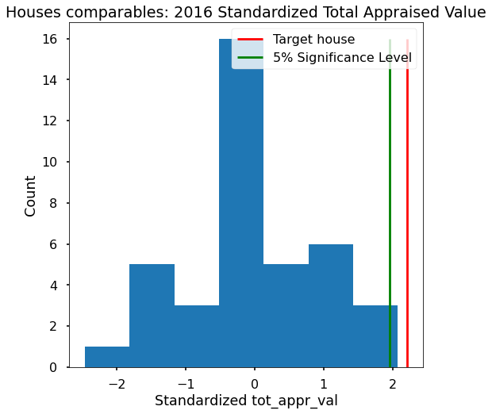

# Harris County Appraisal District (HCAD) property value prediction
Harris County is the [third-most](https://en.wikipedia.org/wiki/List_of_the_most_populous_counties_in_the_United_States) populous county in the USA. Its appraisal district (HCAD) provides a [fantastic dataset](https://pdata.hcad.org/download/index.html) with each appraised property characteristics (appraised value, fixtures, features) reported yearly.

Using these data, I followed the [Data Science Method](https://medium.com/@aiden.dataminer/the-data-science-method-dsm-a-framework-on-how-to-take-your-data-science-projects-to-the-next-91f9fd81e5d1) to understand if my house was fairly appraised in 2016. Then, I constructed a statistical model for predicting house appraised values based on the house's features (area, number of rooms, pool, etc.).

# Results
The results of my work are detailed in the [project report](reports/Capstone_final_report.ipynb) and also in the [project's slide deck](reports/Capstone_Two_Final_presentation.pdf). Here is a summary of my findings:

1. I showed with a hypothesis test that my 2016 HCAD appraised home value was unfair (p-value 0.014). [Notebook 2.2](notebooks/01_Exploratory/2.2-rp-hcad-eda-appraised-value-perc-diff-subdiv-comps-hypothesis-test.ipynb).

2. I built a ridge regression model to estimate the appraised value based on the houses in the neighborhood. My prediction was $34,011 less than HCAD’s, and $5,008 less than HCAD’s after I protested. [Notebook 3.1](notebooks/01_Exploratory/3.1-rp-hcad-preprocessing_data_split_CV_feature_selection_and_modeling.ipynb).

# Set up
Concerning file organization, I'm mostly following the [Cookiecutter Data Science](https://drivendata.github.io/cookiecutter-data-science/) template with [some modifications](https://github.com/RafaelPinto/simplified_project_cookiecutter). Chiefly among them are using a `tasks.py` file and `invoke` as a substitute for `make`, to enable compatibility on systems without access to `make`. Also, I took the liberty of writing new executing commands as I found the ones in the original template a bit cryptic.

Additionally, I repurposed the data folders to follow this flow:
1. External: The original, immutable data dump. All available data is here (or linked here) first.
2. Raw: The external data after the cleaning step.
3. Interim: Raw data that has been transformed (normalized, scaled, etc.).
4. Processed: The final, canonical data sets for modeling.

# Environmnet
I'm using conda for managing packages and environments. Once you have [cloned this repo](https://github.com/RafaelPinto/hcad_pred.git) you'll need to create a conda environment with:

`conda create --name hcad_pred python=3.7 invoke`

where hcad_pred is the name of the newly created environment. Then, you must activate it with:

`conda activate hcad_pred`

With the environment activated, you will be able to run the `invoke` commands present in the [task.py file](tasks.py). First, run `invoke env-update` to install the rest of the dependencies. Next, I recommend running `invoke env-set-jupyter` to enable jupyter notebook extensions. The other `env_` tasks are for when you install new packages. The suggested steps for intalling or removing packages are:

1. Add your package to the [environment.yml file](environment.yml). 
2. `invoke env-update`: Updates the `hcad_pred` environment with the packages in the environment.yml file.
3. `invoke env-freeze`: Updates the environment_to_freeze.yml file. This file contains all of the environment dependencies.
4. [Optional] `invoke env-remove`: If you need to start from scratch. This will remove the `hcad_env`.

# Downloading the data
`invoke download-data`

> **_NOTE:_**  Although the actual function name is `download_data`, to run in the terminal, we must replace the underscore (`_`) with a dash (`-`). This applies to all of my invoke functions.

This command will run script `src/data/download_hcad_data.py`, which will fecth all the available data from the year 2016, and save it to the `data/external/2016` directory.

# Process: select data and EDA
`invoke select-data`

The downloaded data is numerous and comes in multiple files, representing different kinds of data. I took the first look and stab at data preparation with the suite of notebooks `notebooks/01_Exploratory/1.[0-6]`. In the process of converting these exploratory notebooks to a proper `.py` file, I discovered the [papermill library](https://papermill.readthedocs.io/en/latest/). This package allows me to focus on the DS part of the project, so I only abstract away recurring tasks in my notebooks to the `src` local package, and skip translating the notebooks sequence to a `.py` file. This way, we keep the delicate balance between reproducibility and allotted time to accomplish this project.

In the first five files in the `select_data` suite of notebooks, I inspect, decode, and clean the columns, and then I run a summary statistics for each. The resulting cleaned version of the data is saved to `data/raw/2016` directory. The sixth notebook on this series is for joining the results of the previous five into a single file: `data/interim/2016/comps.pickle`

Here is a summary of what each data selection notebook does:

**1.0**: Input data: `Real_building_land/building_res.txt`. This file contains some of the properties descriptions like areas, date erected, quality description, property use code, and percent built. Also, this file contains the HCAD account number associated to each property. In this notebook, I selected the features that represent physical properties of the houses, and filter the properties to contain only Residential single-family homes. I also exported these single-family home account numbers as a stand-alone file that I will use to filter the accounts on load in subsequent notebooks.

**1.1**: Input data: `Real_building_land/fixtures.txt`. This file contains property features like number of bedrooms, full baths, half baths, and more. It comes as a melted table, so we need to use the pivot_table method on the dataframe instance to shape it to a table with one observation per row (HCAD account number). I selected the ten most common features in the properties to prevent columns mostly filled with missing values.

**1.2**: Input data: `Real_acct_owner/real_acct.txt`. This file contains property information like total appraised value (the target on this exercise), neighborhood, school district, economic group, land value, and more.

**1.3**: Input data: `Real_building_land/extra_features.txt`. This file contains property information like number and quality of pools, detached garages, outbuildings, canopies, and more. Similar to the fixtures file, I selected the 15 most common features to minimize the number of missing values.

**1.4**: Input data: `Real_building_land/exterior.txt`. This file contains property information on the areas of the sections of the improved area (base area pri, base area upr, open fram porch pri...). Similar to the fixtures file, I selected the 10 most common features to minimize the number of missing values.

**1.5**: Input data: `Real_building_land/structural_elem1.txt`. This file contains property information about the building data, like foundation type, exterior wall composition, Heating/AC, and more. Similar to the fixtures file, I selected the 7 most common features to minimize the number of missing values.

**1.6**: This file joins the output of the last six notebooks into a single dataframe, and exports it to `data/interim/2016/comps.pickle`.

The resulting merged dataframe has 957686 properties with 87 features. Notebook **2.2** shows the Exploratory Data Analysis that I performed.

# Model
Notebook **3.1** shows the preprocessing steps, training data development, and modeling approach that I applied to the HCAD subdivision data. In this case, I'm using the 110 houses found in the subdivision, not including my target property.